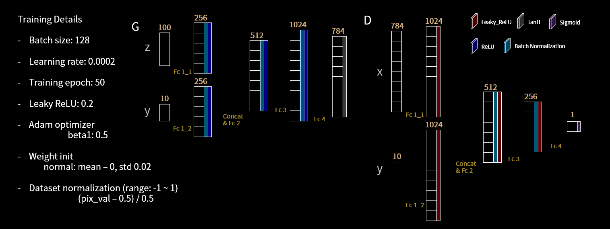
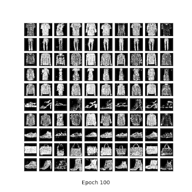
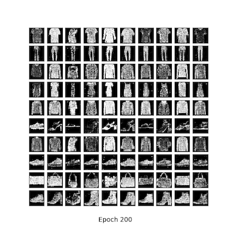
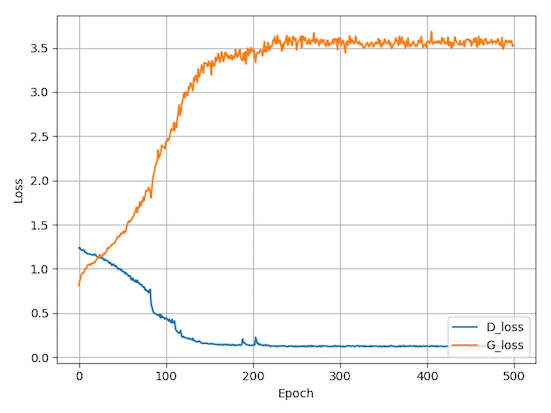

# 
 人工智能导论中期报告 

 **成员**： 钟昊东， 朱文轩， 张知行 

**项目设计**：

&emsp;&emsp; 我们的目标是实现一个生成对抗网络来处理FashionMNIST数据集并通过训练实现高效的同类图片生成。目前的神经网络设计如下图

&emsp;&emsp; 我们主要采用不断降低learning rate的手段来实现训练效果的提升，为了避免在迭代过程中由于learning rate过大导致损失函数长时间降低效果不显著的现象的发生，我们利用十次迭代中的损失函数作为评估标准，如果之后的损失函数降低不够明显，那么我们将learning rate乘以一个小于一的系数decay进行后续的训练。通过这种方式，我们的模型在200次迭代以内有着良好的表现。通过对损失函数变化的观察，我们不断改进训练算法对learning rate的调整的策略。

**当前进度**：

&emsp;&emsp; 目前已经完成基本的GAN网络设计与实现，程序可以正常运转，但是参数设定仍然需要进一步调整，使得生成的图片更为细致，当前训练结果如下图：

&emsp;&emsp; 上图是经过100次迭代之后生成的图片，可以看出其中第六行图片仍然不够清晰，而且整体上看来图片较为粗糙，细节不够明显，和原始数据集的差别较大。

&emsp;&emsp; 上图是我们的网络在200次迭代之后生成的图片，可以看出相比于之前的图片，200次迭代之后的图片在效果上有着很大的提升。但是在细节上的体现仍然不够明显，第六行的图片效果明显不如其他行的图片，可能原因主要由于高跟鞋或凉鞋的细节较多，而且形状多样，因此合成结果不够清晰。

&emsp;&emsp; 我们整体的训练过程如上图所示，可以看出在200次迭代之后效果不是很大，200次迭代之后的损失函数变化基本稳定，需要进一步改进学习率的调整方式来达到更好的效果。

**后续计划**：

&emsp;&emsp; 首先，我们计划进一步改善项目中的超参数设定，通过对学习速率的调整来进一步改进我们产生的图片的质量。同时，受到Progressive Growing of GANs for Improved Quality, Stability, and Variation的启发，我们计划在后续参数调整结束后，如果时间充足，我们会进一步改进我们的神经网络模型，借鉴该研究组的渐进式生成对抗网络设置思路，从而进一步改善我们的模型表现。